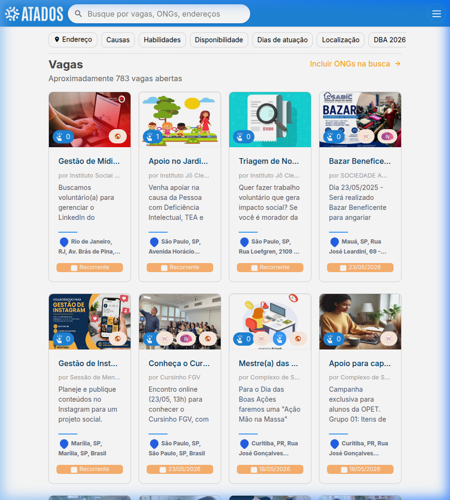
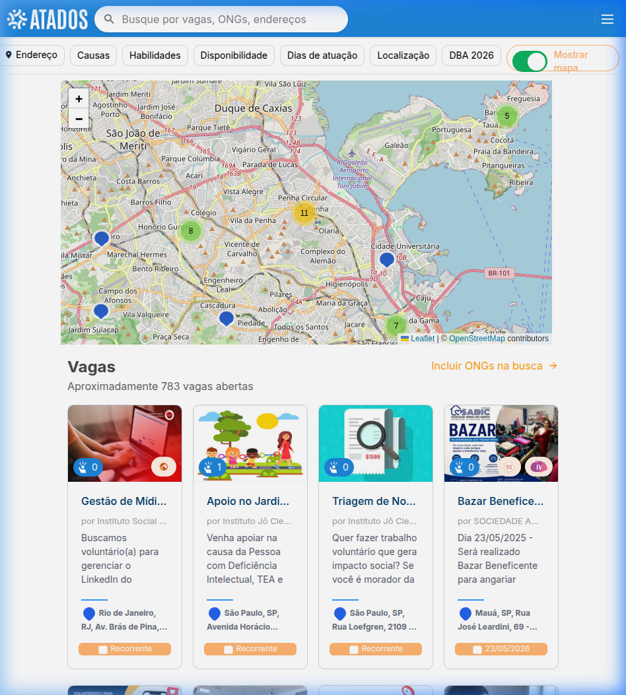
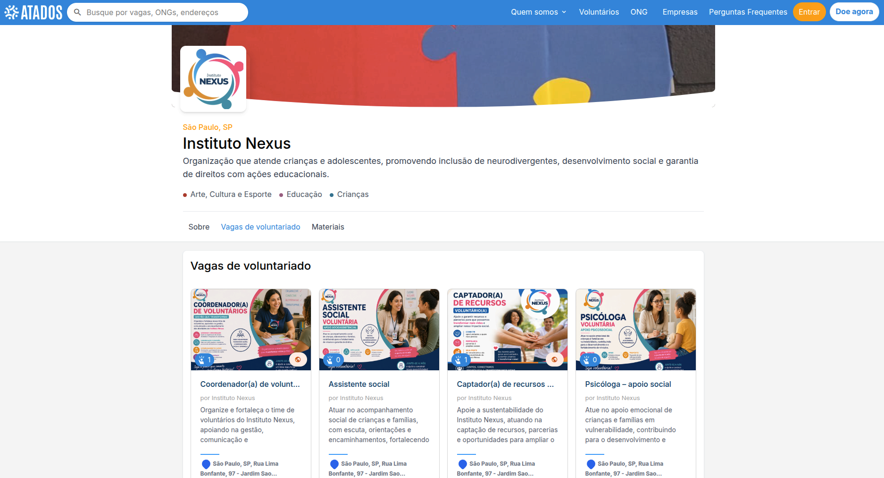
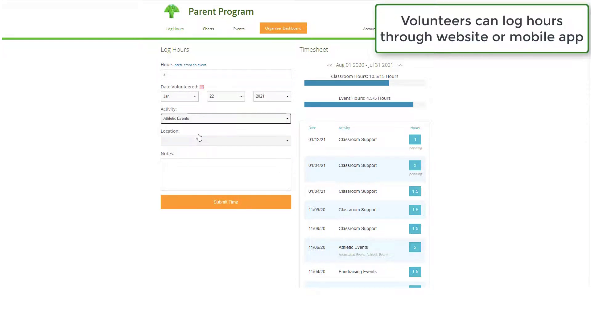
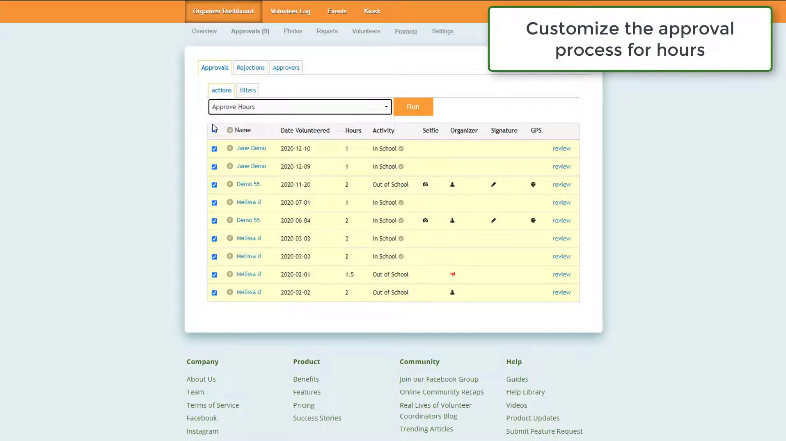
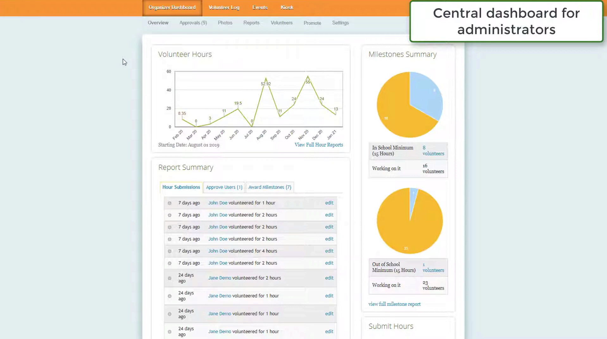
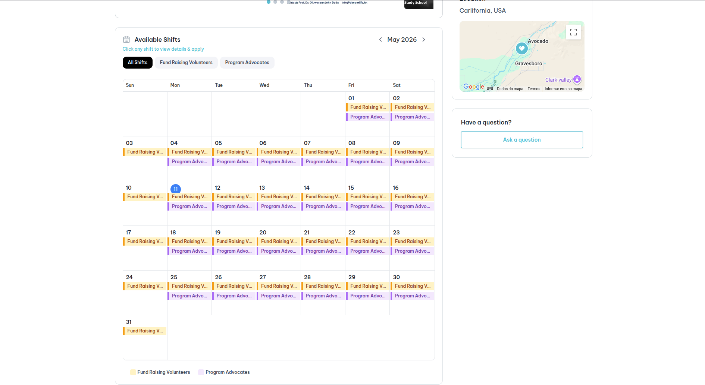
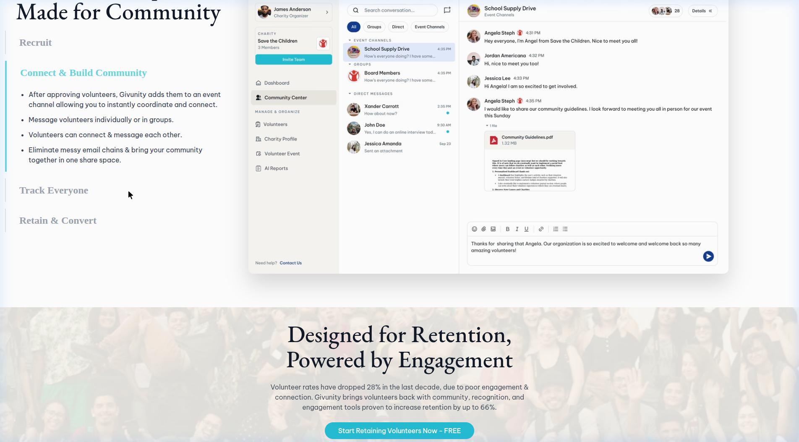

# 📄 ELICITAÇÃO DE REQUISITOS

Para a elicitação de requisitos foram utilzados dois métodos prototipação evolutiva e benchmarking.

# PROTOTIPAÇÃO EVOLUTIVA

## 🎯 Objetivo

Descrever o processo de elicitação de requisitos para um sistema de cadastro e acompanhamento de ONGs, utilizando a técnica de **prototipagem evolutiva**, com apoio de brainstorming.

---

## 🧠 Técnica Utilizada

A técnica adotada foi **prototipagem evolutiva**, seguindo as etapas:

1. Brainstorm inicial entre os desenvolvedores
2. Estruturação de entidades
3. Criação de Fluxo de Telas
4. Definição de requisitos (épicos e histórias)
5. Refinamento iterativo

---

## 🪄 Etapas Realizadas

### 1. Brainstorm

Foram levantadas ideias iniciais para o sistema, incluindo:

- Tipos de usuários:
  - Explorador (usuário comum)
  - Organizador (ONG)
- Funcionalidades principais:
  - Visualização de ONGs e campanhas
  - Interesse em voluntariado
- Estrutura inicial do sistema

📌 **Observação:**  
O voluntariado foi modelado como **manifestação de interesse**, e não como gestão completa, simplificando o sistema.


---
## 🔗 Evidências

### 🧩 Modelagem (UML)

Modelo de entidades proposto:

```plaintext
+----------------------+
|       Usuario       |
+----------------------+
| id: UUID            |
| nome: string        |
| email: string       |
| senha: string       |
| tipo: enum          | -> (EXPLORADOR, ORGANIZADOR, ADMIN)
| created_at: date    |
+----------------------+

+----------------------+
|        ONG           |
+----------------------+
| id: UUID            |
| nome: string        |
| descricao: text     |
| categoria: string   |
| localizacao: string |
| status: enum        | -> (PENDENTE, APROVADA, REJEITADA)
| owner_id: UUID      |
+----------------------+

           |
           | (1:N)
           v

+----------------------+
|      Campanha        |
+----------------------+
| id: UUID            |
| titulo: string      |
| descricao: text     |
| meta_valor: decimal |
| valor_atual: decimal|
| data_inicio: date   |
| data_fim: date      |
| status: enum        | -> (ATIVA, ENCERRADA)
| ong_id: UUID        |
+----------------------+

     -------------------
     |                 |
     v                 v

+----------------------+        +----------------------+
|       Doacao         |        | InteresseVoluntario  |
+----------------------+        +----------------------+
| id: UUID            |        | id: UUID            |
| valor: decimal      |        | mensagem: text      |
| status: enum        |        | status: enum        |
| data: date          |        | (ENVIADO, VISUALIZADO)
| usuario_id: UUID    |        | usuario_id: UUID    |
| campanha_id: UUID   |        | campanha_id: UUID   |
+----------------------+        +----------------------+

```
---
### 🖼️ Navegação entre Telas

- **Landing Page**
  - TO DO: Diagrama de Telas e possível navegação

---

### 📋 Épicos e Histórias

| Épico | História | Descrição |
|------|--------|----------|
| Exploração e Engajamento | Visualizar ONGs e Campanhas ✅| Navegar e visualizar detalhes |
| | Buscar e Filtrar ✅| Encontrar ONGs/campanhas |
| | Demonstrar Interesse/Voluntario ❌| Usuário/Explorador mostrar interesse em campanhas ou em voluntariado|
| | Realizar Doação ❌| Usuário/Explorador poder contribuir financeiramente |
| Gestão de ONGs | Cadastro de ONG ✅| Criar ONG na plataforma |
| | Criar Campanha ⚠️| Hablitar Usuário de ONG criar campanhas |
| | Visualizar Engajamento ❌| Acompanhar doações/interesses |
| | Gerenciar Campanhas ⚠️| Editar e Encerrar campanhas |

Legenda:
- ✅: Feito
- ⚠️: Deve ser Feito
- ❌: Não Feito mas pode ser feito
---

## 📌 Observações Finais

- O sistema foi projetado como **MVP**
- O voluntariado foi simplificado para reduzir complexidade
- A prototipagem será refinada após feedback do professor

# Benchmarking

## 1. Atados (atados.com.br)

O Atados é uma plataforma brasileira de conexão entre pessoas e organizações sociais. O seu grande diferencial é a interface focada na descoberta visual e geográfica das oportunidades.

### Features e Funcionalidades

**Busca e Descoberta**
A página de pesquisa permite que o usuário encontre vagas aplicando filtros precisos: tipo de causa (exemplo: Educação ou Meio Ambiente), modalidade (presencial ou remoto) e habilidades necessárias. O resultado é apresentado em formato de cartões interativos, o que torna a navegação muito semelhante a plataformas ecommerce.


**Mapa Interativo de Causas**
O usuário consegue ter uma visão geral da sua cidade, aproximar o mapa e clicar em marcadores específicos para ler o resumo de uma campanha solidária próxima dele. Isso é especialmente útil para campanhas de doação de bens físicos ou ações comunitárias de bairro.


**Perfil da Organização**
Para gerar confiança e transparência, cada ONG dispõe de um perfil público próprio que centraliza a sua missão, logo e o histórico das oportunidades ativas. Este espaço funciona como uma vitrine oficial da instituição.


### Pontos Positivos e Negativos

**Pontos Positivos:** A implementação do mapa interativo é excelente para incentivar a ação local. Os filtros ajudam os voluntários a encontrar vagas que se encaixam com seus interesses. A página de perfil da instituição passa credibilidade aos doadores e voluntários.

**Pontos Negativos:** A plataforma não possui um sistema de avaliações públicas das ONGs. Não oferece o rastreamento das horas efetivamente trabalhadas pelo voluntário após a inscrição.

---

## 2. Track It Forward (trackitforward.com)

Esta ferramenta foca no registro de horas trabalhadas por voluntários em ONGs.

### Features e Funcionalidades

**Registro e Aprovação de Horas**
O voluntário submete as horas trabalhadas e a atividade realizada, mas o registro só entra para as estatísticas após a aprovação de um administrador da ONG.



**Gestão Visual do Tempo e Relatórios**
A organização visualiza dashboards de gestão e relatórios de horas trabalhadas pelos voluntários.



### Pontos Positivos e Negativos

**Pontos Positivos:** O fluxo de submissão e aprovação de horas garante a integridade dos dados. Os dashboards são robustos para a gestão interna das instituições.

**Pontos Negativos:** É uma ferramenta fechada, não ajudando novos usuários a descobrirem oportunidades ou causas do zero. A interface é baseada em tabelas e gráficos, carecendo de um apelo visual moderno ou funcionalidades geográficas.

---

## 3. Givunity (givunity.com)

O Givunity é uma plataforma voltada para criação de uma comunidade em torno de uma ong, com foco na retenção do voluntário e na criação de um senso de pertencimento.

### Features e Funcionalidades

**Calendário de Eventos e Recrutamento**
A agenda pública, onde os turnos de trabalho ficam visíveis em um formato de calendário, facilitando o planejamento e a inscrição antecipada dos participantes.


**Comunicação Integrada e Comunidade**
Após ser aprovado em uma vaga, o voluntário ganha acesso a canais de chat temáticos dentro da própria aplicação. Isso elimina a dependência de e-mails ou grupos de WhatsApp, centralizando toda a coordenação logística e a troca de arquivos em um ambiente profissional.


### Pontos Positivos e Negativos

**Pontos Positivos:** A unificação da agenda de eventos, do processo de inscrição e do chat no mesmo ambiente cria uma experiência fluida e organizada para os voluntários e gestores. A comunicação centralizada diminui a dependência de ferramentas externas.

**Pontos Negativos:** O foco quase exclusivo em voluntariado deixa de lado outras formas importantes de apoio, como doações de recursos financeiros e materiais.

---

## Requisitos Extraídos do Benchmarking

1. **Descoberta Geográfica em Tempo Real:** Implementação de um mapa interativo onde os usuários podem localizar campanhas solidárias ativas com base na sua localização atual, facilitando o engajamento de vizinhança.
2. **Página Institucional Unificada e Transparente:** Criação de um perfil robusto para cada ONG, agregando os seus contatos, histórico de impacto, causas suportadas e vagas abertas.
3. **Gestão e Validação de Horas:** Sistema robusto em que o usuário registra as suas horas dedicadas, ficando pendentes até a aprovação e validação pela instituição responsável.
4. **Dashboard de Metas e Progresso Pessoal:** Disponibilização de um painel pessoal com barras de progresso e estatísticas, ajudando o usuário a acompanhar os seus próprios objetivos mensais e anuais de impacto social.
5. **Calendário Público de Oportunidades:** Visão agregada em formato de agenda mensal, permitindo que os usuários se organizem com antecedência para participar em ações com data e hora específicas.
6. **Espaço de Comunicação Direta:** Integração de uma área básica de contato ou notificações dentro do perfil da campanha, diminuindo a logística entre o voluntário e o gestor da ONG.