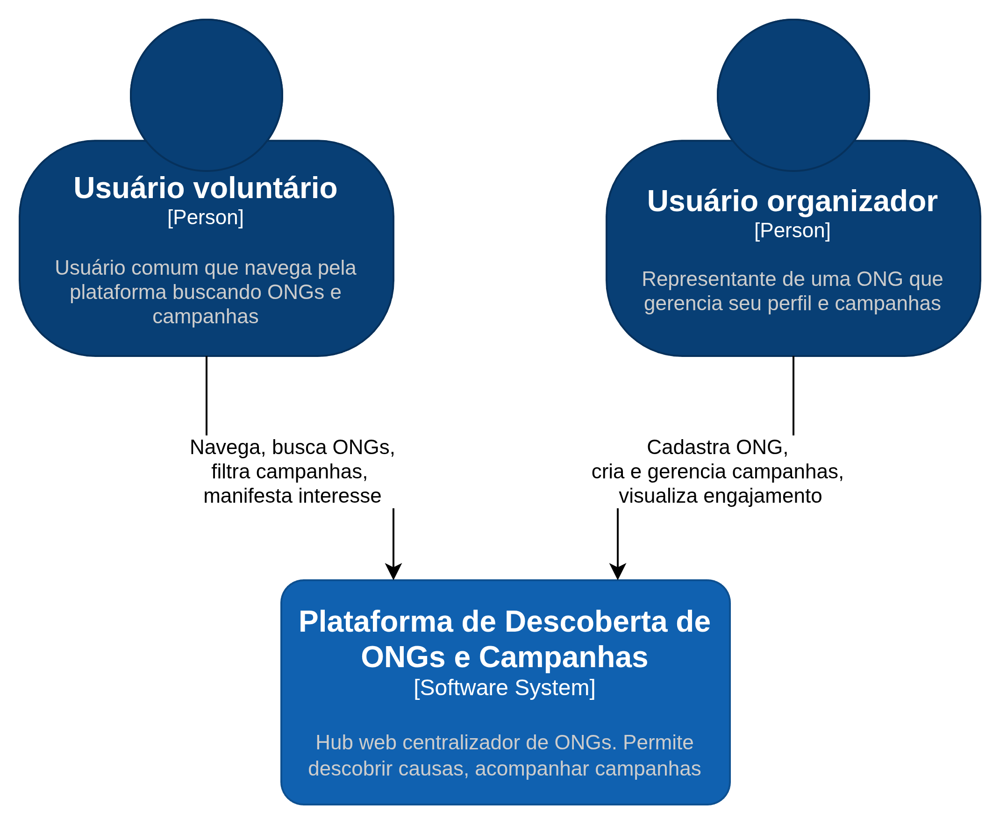
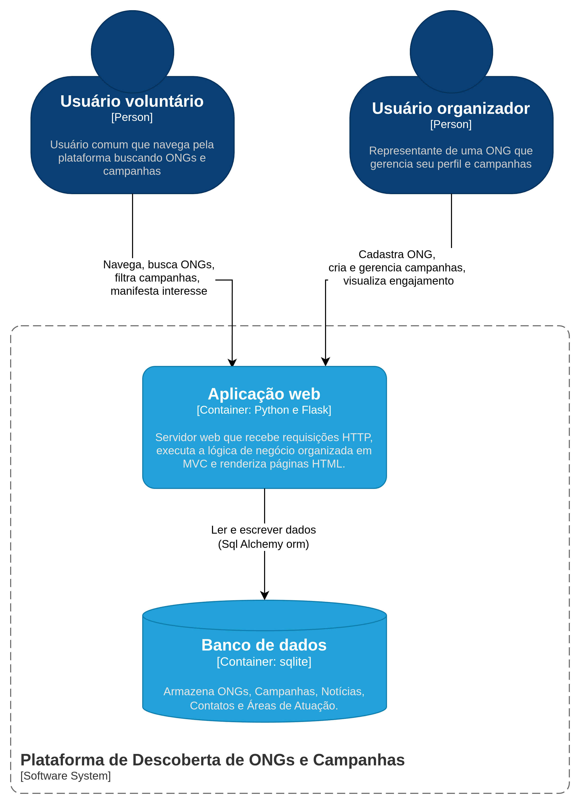
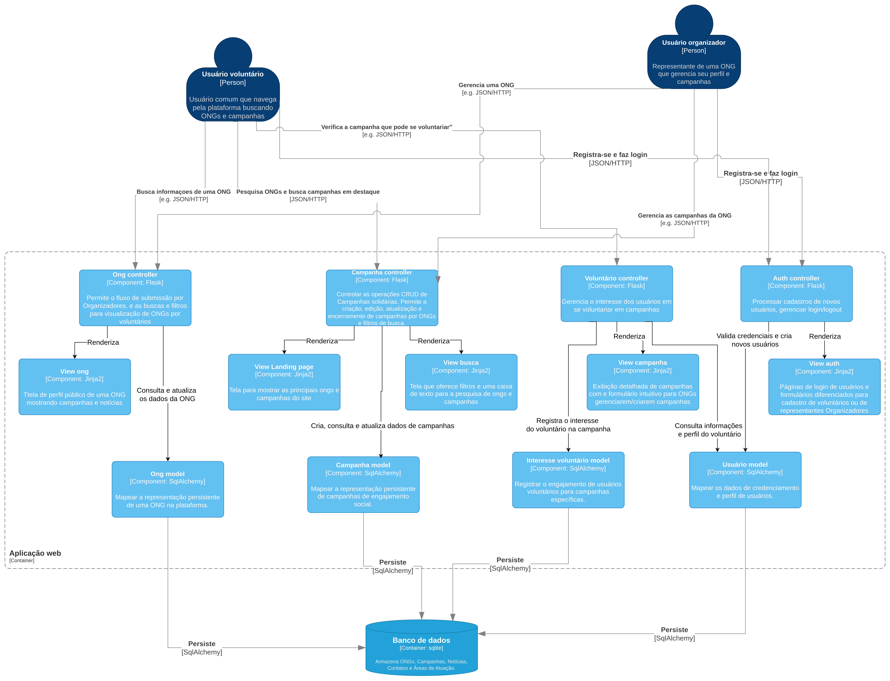

# MC526-Plataforma de Descoberta de ONG's e Campanhas Solidárias
## Membros do grupo
* Marcelo de Souza Corumba de Campos - RA 236730
* Pablo Areia Delgado - RA 223037
* Vitor Takahashi Miranda - RA 231740
* João Vitor Guilherme dos Santos RA 247232
* Caio Cezar Correia - RA 090589

## Descrição do Projeto
Este projeto consiste no desenvolvimento de uma plataforma web que atua como um hub centralizador de organizações não governamentais (ONGs) e iniciativas de caridade. O objetivo é facilitar o acesso da população a informações confiáveis sobre instituições sociais, permitindo que usuários descubram novas causas, acompanhem campanhas ativas, leiam notícias relacionadas ao setor social e consultem opiniões ou avaliações de outros usuários.

Sendo assim, o projeto se alinha principalmente com as ODS 16 (Paz, Justiça e Instituições Eficazes) e 17 (Parcerias e Meios de Implementação)

## Stack Inicial
* Python 3.11+
* Flask 3
* Estrutura com app factory + blueprint

## Estrutura Inicial do Projeto
```text
.
|-- app/
|   |-- __init__.py
|   |-- main/
|   |   |-- __init__.py
|   |   `-- routes.py
|   |-- static/
|   |   `-- css/
|   |       `-- styles.css
|   `-- templates/
|       |-- base.html
|       `-- index.html
|-- config.py
|-- run.py
|-- requirements.txt
`-- .gitignore
```

## Como Rodar o Projeto
No Windows (PowerShell):

```powershell
python -m venv .venv
.\.venv\Scripts\Activate.ps1
pip install -r requirements.txt
python run.py
```

Abra no navegador:
* http://127.0.0.1:5000/
* http://127.0.0.1:5000/health

## Proximos Passos Sugeridos
1. Criar modulo de autenticacao (usuarios, login, permissao).
2. Modelar entidades principais (ONG, Campanha, Noticia, Avaliacao).
3. Integrar banco de dados com SQLAlchemy e migracoes com Flask-Migrate.
4. Adicionar testes automatizados com pytest.

### 1. Diagrama de Componentes (C4 - Nível 3)
A seguir, apresentamos o diagrama em nível de componentes para a arquitetura do sistema:




### 2. Estilo Arquitetural
O estilo arquitetural adotado para o projeto é baseado no padrão **MVC (Model-View-Controller)**, implementado através do framework **Flask**. Essa abordagem organiza a aplicação em três camadas principais:

* **Model (SQLAlchemy):** Gerencia a persistência dos dados, o mapeamento objeto-relacional (ORM) e as regras de negócio associadas aos domínios.
* **View (Jinja2):** Responsável por apresentar as informações para o usuário através de páginas HTML renderizadas no servidor.
* **Controller (Rotas Flask):** Processa as requisições HTTP enviadas pelos usuários, interage com os Models para buscar ou salvar informações e renderiza as Views, injetando os dados necessários.

Além disso, a aplicação segue os princípios do estilo arquitetural de **Camadas (Layered Architecture)**, apresentando as seguintes características:

* **Divisão de Responsabilidades:** Cada camada possui responsabilidades bem definidas, tornando o sistema modular. As Views cuidam da interface gráfica, os Controllers gerenciam o fluxo lógico e os Models cuidam da estrutura de dados e persistência.
* **Encapsulamento:** As camadas ocultam sua implementação interna. As Views não conhecem as regras do banco de dados, elas apenas recebem os dados prontos do Controller. Os Controllers não precisam formular consultas SQL brutas, delegando isso ao ORM.

### 3. Principais Componentes e suas Responsabilidades

**Front-end (Views - Jinja2):**
* **Landing page:** Apresenta a página principal com os principais destaques, ONGs e campanhas do site.
* **Busca:** Tela que oferece filtros e caixas de texto para que os usuários realizem pesquisas personalizadas.
* **Campanha:** Exibe informações detalhadas de campanhas, disponibilizando o formulário de engajamento para voluntários e ferramentas de gerenciamento para organizadores.
* **ONG:** Exibe o perfil público de uma ONG com suas respectivas campanhas e notícias.
* **Auth:** Páginas de login e formulários estruturados para cadastro de voluntários ou de representantes organizadores.

**Back-end (Controllers - Flask):**
* **Campanha Controller:** Controla as operações CRUD de campanhas solidárias e gerencia os filtros de busca.
* **Ong Controller:** Permite o fluxo de submissão e edição de páginas de ONGs por parte dos organizadores, além de preparar os dados para visualização dos voluntários.
* **Voluntário Controller:** Gerencia o interesse dos usuários em se voluntariar nas campanhas, consultando o perfil do voluntário quando necessário.
* **Auth Controller:** Processa os dados de credenciamento de novos usuários e gerencia o controle de sessões (login/logout).

**Banco de Dados e Persistência (Models - SQLAlchemy):**
* **Usuário Model:** Mapeia e persiste os dados de credenciamento, senhas e perfis de todos os usuários cadastrados.
* **Ong Model:** Mapeia a representação persistente de uma ONG na plataforma.
* **Campanha Model:** Mapeia a representação persistente de uma campanha de engajamento social.
* **Interesse Voluntário Model:** Registra o engajamento e vínculo de usuários voluntários a campanhas específicas.
* **Banco de Dados (SQLite):** Contêiner externo que armazena de forma física e estruturada todas as entidades do sistema.